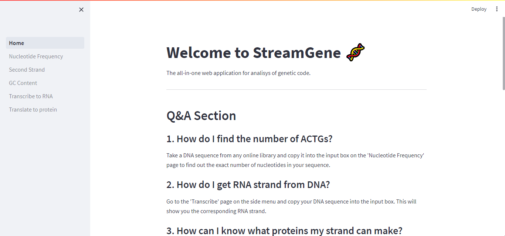

# StreamGene Web App

Made using the **Streamlit** Python framework for datadrivern web applications.

Link to app: https://streamgene.streamlit.app/

**Features:**

- DNA -> RNA
- RNA -> Protein
- GC Content
- Count Nucleotides
- Sequence Length
- Generate Complementary DNA Strand
- Simple and responsive design

**App Screenshot**

